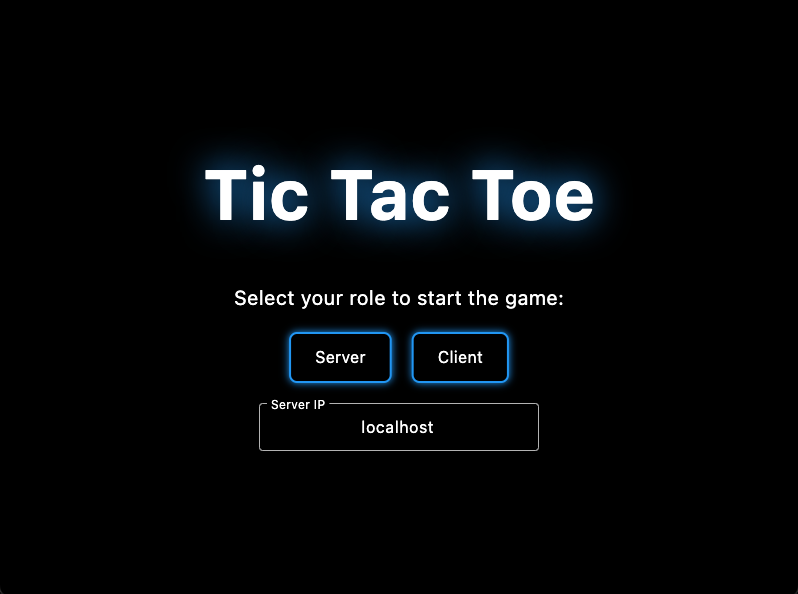
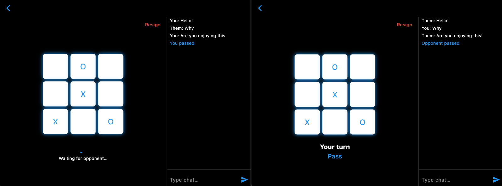

# Tic Tac Toe Game

A classic two-player Tic Tac Toe game built with Flutter and Bloc. Two players take turns marking X and O on a 3×3 grid until one wins or the board fills up in a draw.




---

## Game Logic Description

- **Board**: 3×3 grid of squares.
- **Players**: X always goes first, then O.
- **Turns**:
  - **Mark Square**: Tap an empty square to place your symbol (X or O) on your turn.
  - **Win Check**: After each move, the game checks all rows, columns, and both diagonals for three identical symbols in a line.
  - **Draw**: If all 9 squares are filled without a winner, the game ends in a draw.
- **Score Tracking**:
  - **Local Score**: Each player's total wins and draws are tracked and displayed above the board.

---

## Installation & Setup

1. **Prerequisites**:
   - Flutter SDK (≥2.10)
   - Dart SDK
2. **Clone the Repository**:
   ```bash
   git clone https://github.com/shermanyan/tic_tac_toe_game.git
   cd tic_tac_toe_game
   ```
3. **Install Dependencies**:
   ```bash
   flutter pub get
   ```

---

## Running the Game

1. **Launch the App**:
   ```bash
   flutter run
   ```
2. **Play**:
   - Tap **New Game** on the main screen to start.
   - Players alternate taps on empty squares to place X or O.
   - The current player's turn and score are shown above the board.
   - After a win or draw, tap **Restart** to play again.

---

## Project Structure

- `lib/main.dart`: Application entry point.
- `lib/game_state.dart`: State management and game logic (board state, turn management, win/draw detection, score tracking).
- `lib/player.dart`: UI implementation (grid rendering, input handling, score display, controls).
- `lib/socket_state.dart` (optional): Networking logic for multiplayer games over sockets.
- `lib/message_state.dart` (optional): Chat and message management components.

---
